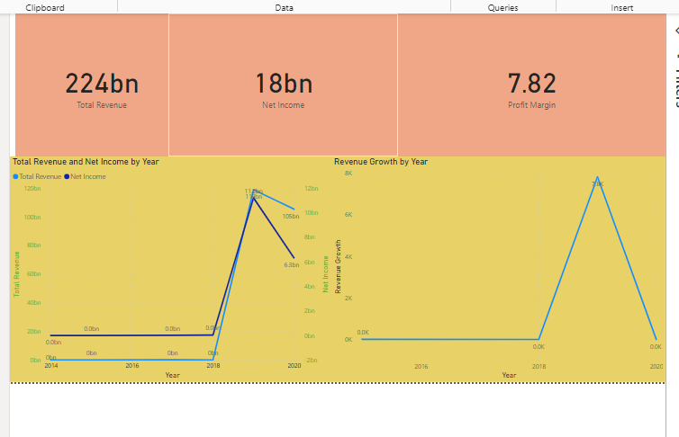

# Power BI Financial Analysis Dashboard

This repository contains a Power BI dashboard designed to provide insights into cash flow, profitability, liquidity, and asset/liability management for public companies. The dashboard uses interactive visuals and DAX measures to present key financial metrics, providing users with a comprehensive view of financial performance.

## Dashboard Previews

### Executive Summary Dashboard

Provides a high-level overview with key metrics:
- **Total Revenue**: Displays the total revenue figure.
- **Net Income**: Shows net income for the period.
- **Profit Margin**: Provides a quick glance at profitability trends across quarters.

### Profitability Analysis Dashboard

This dashboard focuses on profitability metrics:
- **Profit Margin by Quarter**: Tracks profitability trends by quarter, helping identify peak and low profitability periods.
- **Net Income by Year**: Uses a donut chart to show annual net income distribution, offering insights into income growth or decline over the years.

### Liquidity and Cash Flow Dashboard

The Liquidity and Cash Flow Dashboard assesses cash flow health:
- **Operating Cash Flow Ratio by Quarter**: Evaluates how effectively cash is generated relative to liabilities over time.
- **Stacked Column Chart for Cash Flow Analysis**: Displays cash inflows and outflows categorized by operating, investing, and financing activities, providing a comprehensive view of cash flow components.

### Assets and Liabilities Overview

Offers insights into asset and liability management:
- **Total Assets vs. Total Liabilities**: Visual comparison to assess financial stability.
- **Asset and Liability Growth Over Time**: Tracks trends in asset and liability values, helping evaluate the balance between resources and obligations.

---

## Key Insights
- **Q4 Profit Margin** was the highest, highlighting strong profitability at the end of the year.
- **Operating Cash Flow Ratio** peaked in 2020, indicating improved cash flow generation.
- **Net Income Trends** show a steady increase from 2018 to 2020, largely driven by revenue growth.

## Features
- **Executive Summary Dashboard**: Overview of revenue, income, and profit margin for quick insights.
- **Profitability Analysis Dashboard**: Visualizes profit trends and net income distribution.
- **Liquidity and Cash Flow Dashboard**: Analyzes cash flow ratios and breaks down inflows/outflows with a stacked column chart.
- **Assets and Liabilities Overview**: Displays asset and liability values and trends over time.
- **Interactivity**: Includes slicers for filtering by date and region, enhancing user experience and enabling deep dives into specific periods.

## Installation and Usage
1. Download the `.pbix` file from this repository.
2. Open it in Power BI Desktop (available for free from [Microsoft's site](https://powerbi.microsoft.com/desktop/)).
3. Use interactive elements like slicers to explore various financial metrics and visualize data insights.

## Technical Details
- **DAX Calculations**: Custom measures for Profit Margin, Operating Cash Flow Ratio, and Return on Assets (ROA) are implemented.
- **Data Transformations**: The dataset was cleaned and organized using Power Query to ensure data accuracy and consistency.

## Future Improvements
- **Drill-Through Functionality**: Add drill-throughs to enable detailed views based on dates or regions.
- **Conditional Formatting**: Highlight periods of high and low profitability for easier trend identification.

---

This version accurately describes the use of the **Stacked Column Chart** for cash flow analysis instead of the Waterfall Chart. Make sure to replace each `URL_TO_YOUR_IMAGE` placeholder with the actual URLs of the uploaded images.

Let me know if you need any more adjustments!
